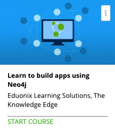

```
Roberto Nogueira  BSd EE, MSd CE
Solution Integrator Experienced - Certified by Ericsson
```
# Learn to build apps using Neo4j



**About the Course**

Data has single handedly become an important factor for individuals and business alike. This is mainly because data can translate into information, especially important information that is required to make big decisions. However, data in its raw form is worth very little. 

Until data is sorted into sections and sub-sections, the data is simply information that is useless. An analysis can only be derived from the data when it is sorted and filed properly to show a pattern. This is where databases come into the picture. 

Databases sort and file data to help show a trend within the data, making the data a powerful tool for business, as well as people. Neo4J is a type of graph database, which helps sort data using a graph making it easier to file and retrieve data. 

Graph databases use a series of nodes, properties and relationships between the nodes, to sort the data. This method makes graph databases faster, more efficient, easy to scale, flexible and agile. It is also easier to fetch and retrieve accurate data because of the relationship between the nodes.

Neo4J is slowly becoming one of the more popular forms of databases because of its simplicity and performance with large amounts of data. Do you want to know how Neo4J can optimize your apps and simplify your life? Well, you’ve come to the right place.

This Neo4J tutorial is the perfect place for you to get started with learning about databases, graph databases and even Neo4J. You don’t even need to have any experience with databases!

This course has been designed to help you start from scratch and master the course in a manner of few hours. You will learn from knowing nothing about databases to mastering one of the most go to graph databases.

The course starts at the very beginning with databases in general and progresses to actually building an application with NodeJS and JavaScript that employs Neo4J.

In this course, you will learn everything about graph databases, general overview of the different types of databases, how graph databases stack up to other relational databases, the advantages of using this particular database, what is Neo4J, how to set up the Neo4J environment, the Cypher Query Language (the core language for interacting with Neo4J), available contributed language drivers, etc. 

After you have mastered the basics and have learned the theory behind Neo4J, you will use those skills to design and build a working application. You will learn how to incorporate nodes, add properties and even create relationships in this application.

Neo4J is the perfect solution for handling large database needs. Learn how to optimize your search queries and simplify your database needs with this database. So, what are you waiting for? Enroll now!

**What are the requirements?**

* Students should have basic knowledge of relational databases like MySQL before starting this course

**What am I going to get from this course?**

* Mater the graph technology database Neo4J
* Learn the professional tips and tricks for Neo4J development
* Learn the use of graph databases
* Learn all about Cypher query language
* Learn all about Language drivers

**What is the target audience?**

* Students who want to start using Graph database like Neo4J will find this course extremely useful

## Table of Contents

```
Section: 1 Course Intro
[x] 1. Introduction 3:29

Section: 2 Intro To Graph Databases
[ ] 2. Section Intro 0:47
[ ] 3. Graph Databases 6:54
[ ] 4. Graphs vs Relational Databases 8:27
[ ] 5. The Graph Data Model 6:19
[ ] Quiz 1: Intro To Graph Databases Quiz 0:00

Section: 3 Getting Started With Neo4j
[ ] 6. Section Intro 0:56
[ ] 7. Introduction to Neo4j 9:41
[ ] 8. Installing Neo4j in Windows 2:49
[ ] 9. Installing Neo4j In Linux 2:32
[ ] 10. Neo4j Browser Interface 8:51
[ ] Quiz 2: Getting Started With Neo4j Quiz 0:00

Section: 4 Cypher & Neo4j Browser
[ ] 11. Section Intro 1:12
[ ] 12. Understanding Cypher Query Language 9:10
[ ] 13. Movie Graph Example 16:01
[ ] 14. Creating & Matching Nodes 8:05
[ ] 15. Creating Relationships 15:49
[ ] 16. Updating & Deleting Nodes & Properties 7:12
[ ] Quiz 3: Cypher & Neo4j Browser Quiz 0:00

Section: 5 More On Cypher & Neo4j
[ ] 17. Section Intro 1:00
[ ] 18. Other Cypher Queries & Clauses 9:08
[ ] 19. Neo4j HTTP REST API 11:05
[ ] 20. Language Drivers 5:07
[ ] Quiz 4: More On Cypher & Neo4j Quiz 0:00

Section: 6 SocialClient Application
[ ] 21. Project Intro 3:47
[ ] 22. Node & Express Server Setup 9:42
[ ] 23. Neo4j Driver Setup 12:45
[ ] 24. Adding Nodes With App 13:46
[ ] 25. Adding Relationships With App 9:17
[ ] 26. Person Details 15:57
[ ] 27. Twitter Bootstrap UI 18:33
[ ] 28. Details Page Forms 5:55

Section: 7 Course Summary
[ ] 29. Summary 2:50
```
